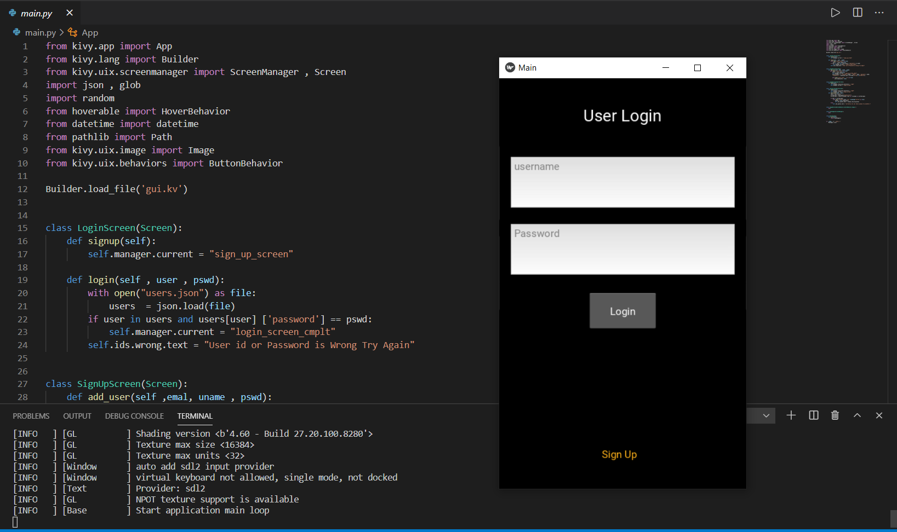

# Share Feel Application
 

## Application Screenshot
 

 

## Application Features
-You can create your account using your 'email' and can set your username and password(All the user data will be stored in users.json file).
-After succesful login you can type your feeling like:- I'm Happy/Sad soon... and based on your mood application will suggest you some quotes.
-In case you forgot your Password/Username you can get it back using your E-mail id.

 

## How can you use this App
Basically this is a muliplatform app you can you it on any OS but even on IOS but for that you need MacBook and for Android use you have to use buildozer to convert it into APK,and
at that for the use of Windows of Linux simply clone this repo and install the necessary libraries and you are good to go.

 

# Accept Pull Requests ;)
